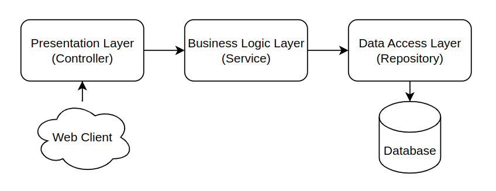

# Shopping List Api

Api desenvolvida com o objetivo de colocar em prática todo o aprendizado adquirido no **[Bootcamp TQI Kotlin - Backend Developer](https://web.dio.me/track/bootcamp-tqi-kotlin)**

### Arquitetura utilizada no Projeto: Three-layer architecture (Arquitetura de três camadas)




- **Controller:** Esta é a interface do usuário do aplicativo que apresenta os recursos e dados do aplicativo para o usuário.

- **Service:** Essa camada contém a lógica de negócios que orienta as principais funcionalidades do aplicativo. Como tomar decisões, cálculos, avaliações e processar os dados que passam entre as outras duas camadas.

- **Repository:** Essa camada é responsável por interagir com os bancos de dados para salvar e restaurar os dados do aplicativo.

  

### 🔨 Setup

Crie o arquivo ***.env*** no diretório raiz do projeto com as seguintes informações:

```bash
DB_USERNAME={USERNAME}
DB_PASSWORD={PASSWORD}
DB_NAME={DATABASE_NAME}
```

### Execute a aplicação em um Container Docker

**Requerimentos**:

- [Docker](https://www.docker.com/)
- [Docker Compose](https://docs.docker.com/compose/)

Crie o arquivo *.jar* da aplicação com o seguinte comando:

```bash
./gradlew clean build
```

Em seguida suba os containers da aplicação e do banco de dados com o seguinte comando:

```bash
docker compose up -d
```

### ⚠️ API em desenvolvimento

Você pode ver o que está sendo desenvolvido [clicando aqui](https://github.com/users/janssenbatista/projects/2).

### 📕 Documentação da API

POST [`/users`]() (cria um usuário)

GET [`/users/{id}`]() (obtém as informações do usuário com o id informado) 🔐

PUT [`/users/{id}`]() (atualiza as informações do usuário com o id informado) 🔐

DELETE [`/users/{id}`]() (deleta o usuário com o id informado) 🔐
